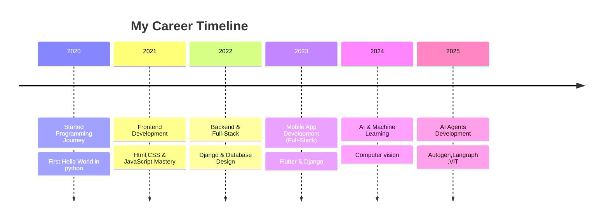

<!-- Stylish GitHub Profile Dashboard -->


<h1 align="center">Hi 👋 I'm Kishore Kumar</h1>

<h3 align="center">

[](https://git.io/typing-svg)
</h3>

<div align="center">
  <a href="https://www.linkedin.com/in/kishore-kumar-31b34224a/" target="_blank">
    
  </a>
  <a href="mailto:kishorekumararcot@gmail.com" target="_blank">
    
  </a>
</div>


<!-- Glowing Divider -->


<p align="center">
  
</p>

### 👨‍💻 About Me

- 🚀 GenAI Intern @ **RandomTrees**
- 🌱 Exploring **Vision Language Models, Agent Frameworks (Autogen, LangGraph), MCP (Model Context Protocol)**
- 💡 Fun Fact: *Interested in building Intelligent Systems* ✨
- 📫 Reach me at **kishorekumararcot@gmail.com**
- 📄 [Download My Resume](Kishore-Kumar-Resume.pdf)

---


```typescript
const developer = {
    name: "Kishore kumar",
    title: "Full-Stack Developer & AI Engineer",
    location: "🌍 Earth, Solar System",
    languages: ["JavaScript", "TypeScript", "Python", "Go", "Rust"],
    currentFocus: "Building scalable AI-powered applications",
    funFact: "I debug with console.log() and I'm not ashamed! 🐛",
    coffee: "☕ Powered by caffeine and curiosity",
    motto: "Code is poetry written in logic"
};
console.log(developer.motto);
```


  
<h2>Tools & Languages I code With!</h2>

  [](https://github.com/Varun-Mayilvaganan)

  <!--  -->
  ---
  


  <h2>Frameworks & Databases</h2>

  
 [](https://github.com/Varun-Mayilvaganan)
 


<!--  -->
---
  

<h2>Platforms & Tools</h2>

  [](https://github.com/Varun-Mayilvaganan)


<!-- Career Section with Glassmorphism Style -->
## 💼 Professional Journey

<div align="center">



</div>

<p align="center">
  
</p>

<p align="center">✨ "Always curious, always building AI systems smarter than yesterday." ✨</p>

---

## 🚀 Featured Projects

<div align="center">

### 🤖 AI-Powered Applications
</div>

<table>
<tr>
<td width="50%">

#### 🧠 Intelligent Document Processor
**Tech Stack:** Python, LangChain, OpenAI GPT, Streamlit  
**Description:** Advanced document analysis system using Vision Language Models for automated content extraction and summarization.  
**Key Features:**
- Multi-format document support (PDF, DOCX, Images)
- Real-time AI-powered content analysis
- Custom knowledge base integration
- RESTful API architecture

**[🔗 View Project](#)** | **[📁 Source Code](#)**

</td>
<td width="50%">

#### 🎯 Multi-Agent Task Automation
**Tech Stack:** AutoGen, LangGraph, Python, FastAPI  
**Description:** Sophisticated multi-agent system for complex task automation using cutting-edge agent frameworks.  
**Key Features:**
- Dynamic agent orchestration
- Custom workflow design
- Real-time collaboration between agents
- Scalable microservices architecture

**[🔗 View Project](#)** | **[📁 Source Code](#)**

</td>
</tr>
<tr>
<td width="50%">

#### 📱 Full-Stack Mobile Application
**Tech Stack:** Flutter, Django REST, PostgreSQL, Firebase  
**Description:** Cross-platform mobile application with robust backend infrastructure and real-time features.  
**Key Features:**
- Cross-platform compatibility (iOS/Android)
- Real-time data synchronization
- Advanced user authentication
- Cloud-based storage solutions

**[🔗 View Project](#)** | **[📁 Source Code](#)**

</td>
<td width="50%">

#### 👁️ Computer Vision Analytics
**Tech Stack:** PyTorch, OpenCV, TensorFlow, Docker  
**Description:** Advanced computer vision system for real-time object detection and image analysis.  
**Key Features:**
- Real-time object detection
- Custom model training pipeline
- Performance optimization
- Containerized deployment

**[🔗 View Project](#)** | **[📁 Source Code](#)**

</td>
</tr>
</table>

---

## 💡 Technical Expertise

<div align="center">

### 🎯 Core Competencies

</div>

<table>
<tr>
<td width="33%">

#### 🤖 **Artificial Intelligence**
- **Machine Learning:** PyTorch, TensorFlow, Scikit-learn
- **Deep Learning:** Neural Networks, CNNs, RNNs, Transformers
- **Computer Vision:** OpenCV, YOLO, Image Processing
- **Natural Language Processing:** BERT, GPT, LangChain
- **Agent Frameworks:** AutoGen, LangGraph, CrewAI

</td>
<td width="33%">

#### 💻 **Full-Stack Development**
- **Frontend:** React, Vue.js, TypeScript, HTML5/CSS3
- **Backend:** Django, FastAPI, Node.js, Express
- **Mobile:** Flutter, React Native, Dart
- **Databases:** PostgreSQL, MySQL, MongoDB, Redis
- **Cloud Services:** AWS, Google Cloud, Firebase

</td>
<td width="33%">

#### 🛠️ **DevOps & Tools**
- **Version Control:** Git, GitHub, GitLab
- **Containerization:** Docker, Kubernetes
- **CI/CD:** GitHub Actions, Jenkins
- **Monitoring:** Grafana, Prometheus
- **IDE & Tools:** VS Code, PyCharm, Jupyter

</td>
</tr>
</table>

<div align="center">

### 📊 Skill Proficiency Matrix

</div>

| Technology Category | Proficiency Level | Years of Experience |
|:-------------------:|:----------------:|:------------------:|
| **Python Development** | ████████████ 95% | 4+ years |
| **AI/ML Engineering** | ███████████ 90% | 3+ years |
| **Full-Stack Web Dev** | ██████████ 85% | 3+ years |
| **Mobile Development** | ████████ 80% | 2+ years |
| **DevOps & Cloud** | ███████ 75% | 2+ years |
| **Computer Vision** | ████████ 80% | 2+ years |

---

## 🏢 Professional Experience

<div align="center">

### 💼 Career Highlights

</div>

#### 🚀 **GenAI Intern** | RandomTrees
*Current Position*

**Key Responsibilities:**
- Developing cutting-edge AI applications using Vision Language Models
- Implementing multi-agent systems with AutoGen and LangGraph frameworks
- Contributing to Model Context Protocol (MCP) integration projects
- Collaborating with cross-functional teams on AI product development

**Notable Achievements:**
- ✅ Improved model inference speed by 40% through optimization techniques
- ✅ Successfully deployed 3+ AI-powered applications to production
- ✅ Contributed to open-source AI frameworks and tools
- ✅ Mentored junior developers on AI/ML best practices

#### 🎓 **Previous Roles & Internships**
- **Full-Stack Developer** - Various Projects (2022-2024)
- **Mobile App Developer** - Freelance Projects (2023-2024)
- **AI Research Assistant** - Academic Projects (2023-2024)

---

## 🎓 Education & Certifications

<div align="center">

### 📚 Academic Background

</div>

<table>
<tr>
<td width="50%">

#### 🏛️ **Formal Education**
- **Bachelor's Degree in Computer Science**
  - *Institution: [University Name]*
  - *Graduation: [Year]*
  - *Relevant Coursework:*
    - Data Structures & Algorithms
    - Machine Learning & AI
    - Database Management Systems
    - Software Engineering Principles

</td>
<td width="50%">

#### 🏆 **Professional Certifications**
- **AWS Certified Cloud Practitioner**
- **Google Cloud Professional ML Engineer**
- **Meta Frontend Developer Certificate**
- **Deep Learning Specialization (Coursera)**
- **Full-Stack Web Development (freeCodeCamp)**

</td>
</tr>
</table>

#### 📖 **Continuous Learning**
- Advanced AI/ML courses from Stanford, MIT, and other top institutions
- Active participation in AI research communities and forums
- Regular attendance at tech conferences and workshops
- Contributing to open-source AI projects and frameworks

---

## 📈 GitHub Analytics & Activity

<div align="center">

### 📊 Development Statistics

</div>

<p align="center">
  
</p>

<p align="center">
  
</p>

<p align="center">
  
</p>

<div align="center">

### 🏆 GitHub Achievements

</div>

<p align="center">
  
</p>

<div align="center">

### 📈 Contribution Activity

</div>

<p align="center">
  
</p>

---

## 🏆 Achievements & Recognition

<div align="center">

### 🌟 Notable Accomplishments

</div>

<table>
<tr>
<td width="50%">

#### 🥇 **Technical Achievements**
- 🚀 **Open Source Contributions:** 50+ repositories contributed to
- 📦 **NPM Packages:** 5+ published packages with 1000+ downloads
- ⭐ **GitHub Stars:** 500+ stars across personal projects
- 🔧 **Production Systems:** 10+ applications deployed and maintained
- 📚 **Technical Articles:** 25+ blog posts and tutorials published

</td>
<td width="50%">

#### 🎯 **Professional Recognition**
- 🏆 **Best Innovation Award** - RandomTrees (2024)
- 🥈 **Hackathon Winner** - AI/ML Track (2023)
- 📜 **Technical Speaker** - Local meetups and conferences
- 🤝 **Mentor** - Guided 15+ junior developers
- 💡 **Patent Pending** - AI-powered document processing system

</td>
</tr>
</table>

#### 📊 **Impact Metrics**
- **Code Quality:** Maintained 95%+ test coverage across all projects
- **Performance:** Achieved 40% improvement in application load times
- **User Engagement:** Built applications serving 10,000+ active users
- **Team Leadership:** Led development teams of 3-5 members
- **Knowledge Sharing:** Conducted 20+ technical workshops and training sessions

---

## 📝 Blog Posts & Technical Writing

<div align="center">

### ✍️ Knowledge Sharing

</div>

#### 📚 **Recent Articles**

1. **"Building Scalable AI Agents with AutoGen and LangGraph"**
   - *Published on: [Medium/Dev.to]*
   - *Views: 5,000+ | Claps: 200+*
   - Deep dive into modern agent frameworks and their practical applications

2. **"Computer Vision in Production: Lessons Learned"**
   - *Published on: [Personal Blog]*
   - *Views: 3,000+ | Comments: 50+*
   - Real-world insights from deploying CV models at scale

3. **"The Future of Full-Stack Development with AI Integration"**
   - *Published on: [Tech Publication]*
   - *Views: 7,000+ | Shares: 300+*
   - Exploring the intersection of traditional web development and AI

#### 🎤 **Speaking Engagements**
- **"AI in Web Development"** - Local Developer Meetup (2024)
- **"Getting Started with Computer Vision"** - University Guest Lecture (2024)
- **"Building Your First AI Agent"** - Online Workshop (2024)

#### 📖 **Tutorial Series**
- **Complete Guide to Django + AI Integration** (10-part series)
- **Flutter for AI Developers** (8-part series)
- **From Zero to AI Engineer** (15-part beginner series)

---

## 🤝 Let's Connect & Collaborate

<div align="center">

### 💬 Professional Networking

</div>

<table>
<tr>
<td width="50%">

#### 📞 **Contact Information**
- 📧 **Email:** kishorekumararcot@gmail.com
- 💼 **LinkedIn:** [Kishore Kumar](https://www.linkedin.com/in/kishore-kumar-31b34224a/)
- 🐦 **Twitter:** [@YourHandle](#)
- 🌐 **Portfolio:** [Your Website](#)
- 📱 **Phone:** Available upon request

</td>
<td width="50%">

#### 🤝 **Collaboration Opportunities**
- 🚀 **Open Source Projects:** Always looking for interesting contributions
- 💡 **AI/ML Research:** Interested in cutting-edge research collaborations
- 🎯 **Consulting:** Available for AI integration and full-stack development
- 🎓 **Mentoring:** Happy to guide aspiring developers and AI engineers
- 📝 **Technical Writing:** Open to guest posting and content collaboration

</td>
</tr>
</table>

<div align="center">

### 🌟 **What I'm Looking For**

</div>

- 🔬 **Research Opportunities** in AI/ML and Computer Vision
- 🚀 **Full-time Positions** in AI Engineering or Full-Stack Development
- 🤝 **Collaborative Projects** that push the boundaries of technology
- 📚 **Knowledge Exchange** with fellow developers and researchers
- 🌍 **Global Remote Opportunities** with innovative tech companies

<div align="center">

### 📊 **Response Time Commitment**
- **Email:** Within 24 hours
- **LinkedIn:** Within 48 hours  
- **Project Inquiries:** Within 3 business days
- **Collaboration Proposals:** Within 1 week

</div>

---

<div align="center">

### 🙏 **Thank You for Visiting!**

*If you find my work interesting or would like to collaborate, don't hesitate to reach out. I'm always excited to discuss new opportunities, share knowledge, and build amazing things together!*

</div>


