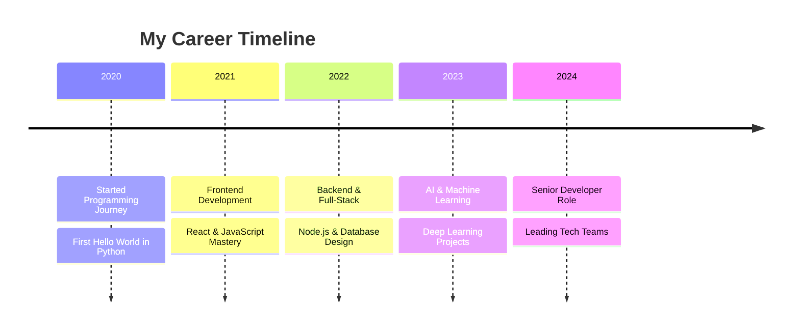

<div align="center">

<!-- Dynamic Animated Header Banner -->


<!-- Animated Typing Text -->


</div>

---

<!-- Glowing Divider -->


## 🌟 About Me


```typescript
const developer = {
    name: "Kishore kumar",
    title: "Full-Stack Developer & AI Engineer",
    location: "🌍 Earth, Solar System",
    languages: ["JavaScript", "TypeScript", "Python", "Go", "Rust"],
    currentFocus: "Building scalable AI-powered applications",
    funFact: "I debug with console.log() and I'm not ashamed! 🐛",
    coffee: "☕ Powered by caffeine and curiosity",
    motto: "Code is poetry written in logic"
};

console.log(developer.motto);
```

### 🎯 Current Mission
> Transforming ideas into elegant code solutions while exploring the frontiers of artificial intelligence and web technologies.

---

<!-- Social Links Section -->
<div align="center">

### 🤝 Let's Connect & Collaborate

[](https://linkedin.com/in/yourprofile)
[](https://yourportfolio.com)
[](mailto:your.email@gmail.com)
[](https://twitter.com/yourhandle)
[](https://github.com/yourusername)

</div>

---

<!-- Career Section with Glassmorphism Style -->
## 💼 Professional Journey

<div align="center">



</div>

### 🚀 Current Role
**Senior Full-Stack Developer** @ **TechCorp Inc.**
- 🔧 Building scalable microservices architecture
- 🤖 Implementing AI-driven features
- 👥 Mentoring junior developers
- 📈 Optimizing application performance by 40%

---

<!-- GitHub Stats Section -->
## 📊 GitHub Analytics & Achievements

<div align="center">

### 🏆 GitHub Trophies
[](https://github.com/ryo-ma/github-profile-trophy)

### 📈 Contribution Stats


### 🔥 Contribution Streak


### 📊 Activity Graph
[](https://github.com/ashutosh00710/github-readme-activity-graph)

</div>

---

<!-- Skills Section with Dynamic Icons -->
## 🛠️ Tech Arsenal & Skills

<div align="center">

### 🎨 Frontend Development


### ⚙️ Backend Development


### 🗄️ Databases & Storage


### 🤖 AI/ML & Data Science


### ☁️ Cloud & DevOps


### 🔧 Tools & Platforms


</div>

### 📈 Skill Proficiency Levels

<div align="center">

| Skill Category | Proficiency |
|:---:|:---:|
| **Frontend Development** |  |
| **Backend Development** |  |
| **Database Management** |  |
| **AI/ML Engineering** |  |
| **Cloud & DevOps** |  |
| **Mobile Development** |  |

</div>

---

<!-- Projects Showcase -->
## 🚀 Featured Projects & Innovations

<div align="center">

### 🌟 Highlighted Repositories
[](https://github.com/yourusername/awesome-project-1)
[](https://github.com/yourusername/awesome-project-2)
[](https://github.com/yourusername/awesome-project-3)
[](https://github.com/yourusername/awesome-project-4)

</div>

---

<!-- Dynamic Widgets Section -->
## 📚 Latest Blog Posts & Activities

<div align="center">

### 📝 Recent Medium Articles
<!-- BLOG-POST-LIST:START -->
- [Building Scalable Microservices with Node.js](https://medium.com/@yourusername/building-scalable-microservices)
- [The Future of AI in Web Development](https://medium.com/@yourusername/ai-web-development)
- [Mastering React Performance Optimization](https://medium.com/@yourusername/react-performance)
<!-- BLOG-POST-LIST:END -->

### 🎵 Currently Vibing To
[](https://spotify-github-profile.vercel.app/api/view?uid=yourspotifyid&redirect=true)

</div>

---

<!-- Inspirational Quote Section -->
## 💭 Daily Inspiration

<div align="center">

### ✨ Quote of the Day


### 🎯 Personal Philosophy
> *"The best way to predict the future is to invent it."* - Alan Kay

*Every line of code is a step toward building tomorrow's solutions.*

</div>

---

<!-- Fun Stats & Metrics -->
## 📊 Fun Facts & Metrics

<div align="center">

### 🎮 Coding Stats
<!--START_SECTION:waka-->
```text
TypeScript   12 hrs 30 mins  ████████████░░░░░░░░░░░░░   50.2%
JavaScript   8 hrs 15 mins   ████████░░░░░░░░░░░░░░░░░   33.1%
Python       3 hrs 45 mins   ███░░░░░░░░░░░░░░░░░░░░░░   15.1%
CSS          2 hrs 10 mins   ██░░░░░░░░░░░░░░░░░░░░░░░    8.7%
Other        1 hr 30 mins    █░░░░░░░░░░░░░░░░░░░░░░░░    6.0%
```
<!--END_SECTION:waka-->

### 📈 This Week's Development Breakdown
- 🔥 **52** commits across **8** repositories
- 🐛 **15** issues closed
- 🔀 **7** pull requests merged
- ⭐ **23** new stars received
- 🍴 **5** repositories forked

</div>

---

<!-- Support Section -->
## ☕ Support My Work

<div align="center">

If you find my projects helpful, consider supporting my caffeine addiction! ☕

[](https://buymeacoffee.com/yourusername)
[](https://ko-fi.com/yourusername)
[](https://paypal.me/yourusername)

### 🌟 Sponsor Benefits
- 📧 Priority email support
- 🎯 Feature requests consideration
- 🏷️ Your name in project credits
- 🚀 Early access to new tools

</div>

---

<!-- Footer Section -->
<div align="center">

### 🎯 Let's Build Something Amazing Together!


### 📊 Profile Views Counter


### 🤝 Open to Collaborate On
- 🚀 **Full-stack web applications**
- 🤖 **AI/ML projects**
- 📱 **Mobile app development**
- 🌐 **Open source contributions**
- 💡 **Innovative tech solutions**

---


**⭐ Star my repositories if you find them interesting!**

*Made with ❤️ and lots of ☕*

</div>
