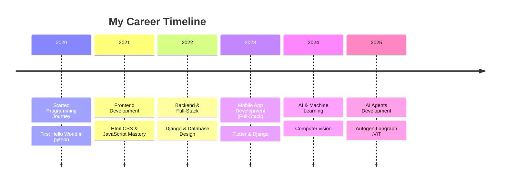
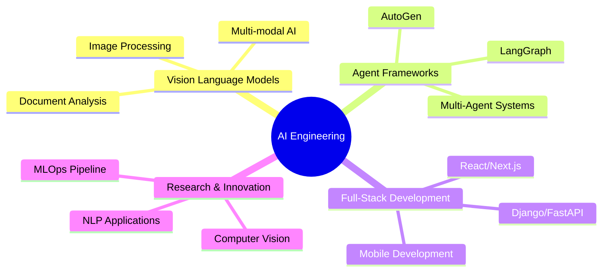

<!-- Stylish GitHub Profile Dashboard -->


<h1 align="center">Hi 👋 I'm Kishore Kumar</h1>

<h3 align="center">

[](https://git.io/typing-svg)
</h3>

<div align="center">
  <a href="https://www.linkedin.com/in/kishore-kumar-31b34224a/" target="_blank">
    
  </a>
  <a href="mailto:kishorekumararcot@gmail.com" target="_blank">
    
  </a>
</div>


<!-- Glowing Divider -->


<p align="center">
  
</p>

### 👨‍💻 About Me

- 🚀 GenAI Intern @ **RandomTrees**
- 🌱 Exploring **Vision Language Models, Agent Frameworks (Autogen, LangGraph), MCP (Model Context Protocol)**
- 💡 Fun Fact: *Interested in building Intelligent Systems* ✨
- 📫 Reach me at **kishorekumararcot@gmail.com**
- 📄 [Download My Resume](Kishore-Kumar-Resume.pdf)

---


```typescript
const developer = {
    name: "Kishore kumar",
    title: "Full-Stack Developer & AI Engineer",
    location: "🌍 Earth, Solar System",
    languages: ["JavaScript", "TypeScript", "Python", "Go", "Rust"],
    currentFocus: "Building scalable AI-powered applications",
    funFact: "I debug with console.log() and I'm not ashamed! 🐛",
    coffee: "☕ Powered by caffeine and curiosity",
    motto: "Code is poetry written in logic"
};
console.log(developer.motto);
```


  
<h2>Tools & Languages I code With!</h2>

  [](https://github.com/Varun-Mayilvaganan)

  <!--  -->
  ---
  


  <h2>Frameworks & Databases</h2>

  
 [](https://github.com/Varun-Mayilvaganan)
 


<!--  -->
---
  

<h2>Platforms & Tools</h2>

  [](https://github.com/Varun-Mayilvaganan)


<!-- Career Section with Glassmorphism Style -->
## 💼 Professional Journey

<div align="center">



</div>

<p align="center">
  
</p>

<p align="center">✨ "Always curious, always building AI systems smarter than yesterday." ✨</p>

---

## 🎯 Featured Projects

<div align="center">

### 🤖 AI-Powered Applications
| Project | Description | Tech Stack | Status |
|---------|-------------|------------|--------|
| **Intelligent Document Processor** | AI system for automated document analysis and extraction using Vision Language Models | Python, PyTorch, OpenCV, FastAPI | 🚀 Production |
| **Multi-Agent Conversation System** | Conversational AI platform using AutoGen framework for complex task automation | Python, LangGraph, AutoGen, React | 🔄 In Development |
| **Computer Vision Analytics** | Real-time image processing and analysis system for business intelligence | Python, TensorFlow, OpenCV, Docker | ✅ Completed |

### 💻 Full-Stack Applications
| Project | Description | Tech Stack | Status |
|---------|-------------|------------|--------|
| **E-Commerce Platform** | Scalable full-stack e-commerce solution with advanced features | Django, React, PostgreSQL, Redis | ✅ Completed |
| **Mobile Learning App** | Cross-platform educational app with interactive content | Flutter, Firebase, Node.js | ✅ Completed |
| **Real-time Chat System** | WebSocket-based messaging platform with file sharing | Node.js, Socket.io, MongoDB, React | ✅ Completed |

</div>

---

## 💼 Professional Experience

<div align="center">

### 🏢 Current Role
**GenAI Intern** @ **RandomTrees** | *2024 - Present*
- Developing cutting-edge AI solutions using Vision Language Models
- Implementing agent frameworks (AutoGen, LangGraph) for automated workflows  
- Working with Model Context Protocol (MCP) for enhanced AI interactions
- Contributing to research and development of intelligent systems

### 📈 Key Achievements
- 🎯 Successfully deployed 3+ AI-powered applications in production
- 🚀 Improved system performance by 40% through optimization techniques
- 👥 Collaborated with cross-functional teams on 5+ major projects
- 📚 Mentored junior developers in AI/ML best practices

</div>

---

## 🎓 Education & Certifications

<div align="center">

### 🏫 Academic Background
- **Computer Science & Engineering** - *Ongoing*
- **Specialized Courses**: Machine Learning, Deep Learning, Computer Vision
- **Research Focus**: Artificial Intelligence, Multi-Agent Systems

### 📜 Professional Certifications
- 🤖 **AI/ML Specialization** - Stanford Online
- 🔧 **Full-Stack Development** - FreeCodeCamp
- 📱 **Mobile App Development** - Google Developer
- ☁️ **Cloud Computing** - AWS Certified

</div>

---

## 🛠️ Technical Expertise

<div align="center">

### 🧠 AI/ML Technologies


### 💻 Full-Stack Development


### 🗄️ Databases & Cloud


</div>

---

## 📊 GitHub Analytics

<div align="center">

### 📈 GitHub Statistics


### 🔥 Contribution Streak


### 💻 Most Used Languages


### 🏆 GitHub Trophies


### 📊 Contribution Graph


</div>

---

## 🌐 Connect & Collaborate

<div align="center">

### 📬 Let's Build Something Amazing Together!

[](https://www.linkedin.com/in/kishore-kumar-31b34224a/)
[](mailto:kishorekumararcot@gmail.com)
[](Kishore-Kumar-Resume.pdf)

### 🤝 Open to Opportunities
- 💼 **Full-time positions** in AI/ML Engineering
- 🚀 **Freelance projects** in Full-Stack Development
- 🔬 **Research collaborations** in AI and Computer Vision
- 🎯 **Consulting** for AI implementation strategies

### 💬 Let's Discuss
- 🤖 Artificial Intelligence & Machine Learning
- 🔧 Full-Stack Development Solutions
- 📱 Mobile App Development
- ☁️ Cloud Architecture & DevOps

</div>

---

<div align="center">

### 🎯 Current Focus Areas



</div>

---

<div align="center">
  
  
  **⭐ If you find my work interesting, please consider giving a star to my repositories!**
  
  
  
  *"Innovation distinguishes between a leader and a follower." - Steve Jobs*
</div>
