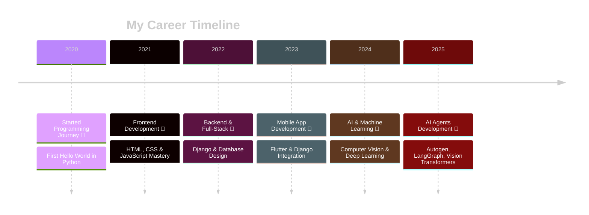

<!-- Dark Theme GitHub Profile Dashboard -->

<div align="center">
  
</div>

<div align="center" style="background: linear-gradient(135deg, #0c0c0c 0%, #1a1a1a 100%); padding: 20px; border-radius: 15px; margin: 20px 0;">

<h1 align="center" style="color: #ffffff; text-shadow: 0 0 20px #bb86fc;">
   
  Hi, I'm Kishore Kumar
</h1>

<h3 align="center">
[](https://git.io/typing-svg)
</h3>

</div>

<div align="center" style="background: rgba(30, 30, 30, 0.8); padding: 15px; border-radius: 12px; margin: 20px 0; backdrop-filter: blur(10px);">
  <a href="https://www.linkedin.com/in/kishore-kumar-31b34224a/" target="_blank">
    
  </a>
  &nbsp;&nbsp;
  <a href="mailto:kishorekumararcot@gmail.com" target="_blank">
    
  </a>
</div>


<!-- Dark Theme Divider -->


<div align="center">
  
</div>

<div style="background: linear-gradient(135deg, #1a1a1a 0%, #2d2d2d 100%); padding: 25px; border-radius: 15px; margin: 20px 0; border: 1px solid #333;">

###  About Me

<div style="color: #e5e7eb; font-size: 16px; line-height: 1.8;">

- 🚀 **GenAI Intern** @ **RandomTrees** 
- 🌱 **Exploring:** Vision Language Models, Agent Frameworks (Autogen, LangGraph), MCP (Model Context Protocol)
- 💡 **Fun Fact:** *Interested in building Intelligent Systems* ✨
- 📫 **Reach me at:** [kishorekumararcot@gmail.com](mailto:kishorekumararcot@gmail.com)
- 📄 **[Download My Resume](Kishore-Kumar-Resume.pdf)** 

</div>
</div>


<div style="display: flex; align-items: center; background: linear-gradient(135deg, #0f0f0f 0%, #1a1a1a 100%); padding: 20px; border-radius: 15px; margin: 20px 0; border: 1px solid #333;">

<div style="flex: 1;">

```typescript
const developer = {
    name: "Kishore kumar",
    title: "Full-Stack Developer & AI Engineer",
    location: "🌍 Earth, Solar System",
    languages: ["JavaScript", "TypeScript", "Python", "Go", "Rust"],
    currentFocus: "Building scalable AI-powered applications",
    funFact: "I debug with console.log() and I'm not ashamed! 🐛",
    coffee: "☕ Powered by caffeine and curiosity",
    motto: "Code is poetry written in logic"
};

console.log(`%c${developer.motto}`, 'color: #bb86fc; font-weight: bold;');
```

</div>

<div align="center">
  
</div>

</div>


<div style="background: linear-gradient(135deg, #1a1a1a 0%, #2d2d2d 100%); padding: 25px; border-radius: 15px; margin: 20px 0; border: 1px solid #333;">

##  Tools & Languages I Code With

<div align="center">
  [](https://skillicons.dev)
</div>

</div>


<div style="background: linear-gradient(135deg, #1a1a1a 0%, #2d2d2d 100%); padding: 25px; border-radius: 15px; margin: 20px 0; border: 1px solid #333;">

##  Frameworks & Databases

<div align="center">
  [](https://skillicons.dev)
</div>

</div>


<div style="background: linear-gradient(135deg, #1a1a1a 0%, #2d2d2d 100%); padding: 25px; border-radius: 15px; margin: 20px 0; border: 1px solid #333;">

##  Platforms & Tools

<div align="center">
  [](https://skillicons.dev)
</div>

</div>


<!-- Dark Theme Career Section -->
<div style="background: linear-gradient(135deg, #0f0f0f 0%, #1a1a1a 100%); padding: 30px; border-radius: 20px; margin: 20px 0; border: 2px solid #333; box-shadow: 0 0 30px rgba(187, 134, 252, 0.1);">

##  Professional Journey

<div align="center">



</div>

<div align="center" style="margin-top: 30px;">
  
</div>

<div align="center" style="background: rgba(187, 134, 252, 0.1); padding: 20px; border-radius: 15px; margin-top: 20px; border: 1px solid rgba(187, 134, 252, 0.3);">
  <h3 style="color: #bb86fc; text-shadow: 0 0 10px rgba(187, 134, 252, 0.5);">
    ✨ "Always curious, always building AI systems smarter than yesterday." ✨
  </h3>
</div>

</div>

<div align="center">
  
</div>


