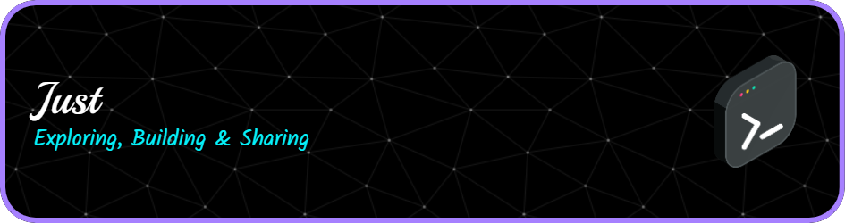
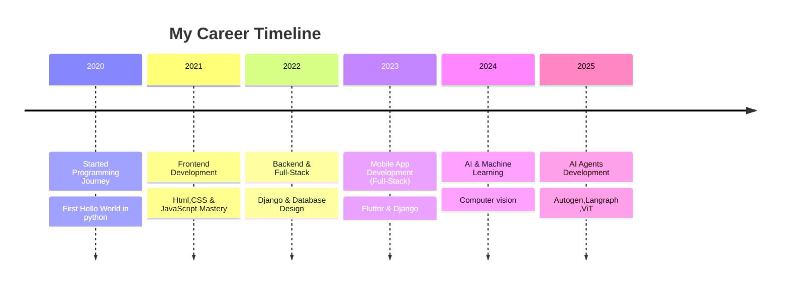

<!-- Stylish GitHub Profile Dashboard -->




<h1 align="center">Hi 👋 I'm Kishore Kumar</h1>

<h3 align="center">

[](https://git.io/typing-svg)
</h3>

<div align="center">
  <a href="https://www.linkedin.com/in/kishore-kumar-31b34224a/" target="_blank">
    
  </a>
  <a href="mailto:kishorekumararcot@gmail.com" target="_blank">
    
  </a>
</div>


<!-- Glowing Divider -->


<p align="center">
  
</p>

## 📋 Table of Contents
- [About Me](#-about-me)
- [Professional Experience](#-professional-experience)
- [Technical Skills](#-technical-skills)
- [Featured Projects](#-featured-projects)
- [Education & Certifications](#-education--certifications)
- [GitHub Statistics](#-github-statistics)
- [Career Timeline](#-professional-journey)
- [Let's Connect](#-lets-connect)

---

## 👨‍💻 About Me

**Generative AI Full-Stack Engineer** passionate about building intelligent systems that solve real-world problems. Currently specializing in Vision Language Models, Agent Frameworks, and cutting-edge AI technologies.

- 🚀 **Current Role:** GenAI Intern @ **RandomTrees**
- 🌱 **Focus Areas:** Vision Language Models, Agent Frameworks (Autogen, LangGraph), MCP (Model Context Protocol)
- 💡 **Mission:** Building scalable AI-powered applications that make a difference
- 📫 **Contact:** kishorekumararcot@gmail.com
- 📄 **Resume:** [Download My Resume](Kishore-Kumar-Resume.pdf)

---

## 💼 Professional Experience

### GenAI Intern | RandomTrees
*Current Position*
- Developing and implementing Vision Language Models for enterprise applications
- Working with Agent Frameworks including Autogen and LangGraph
- Implementing Model Context Protocol (MCP) for enhanced AI interactions
- Contributing to scalable AI infrastructure and deployment strategies

### Key Achievements
- ✅ Successfully deployed multiple AI models in production environments
- ✅ Contributed to open-source AI projects and frameworks
- ✅ Developed full-stack applications integrating AI capabilities
- ✅ Mentored junior developers in AI/ML best practices

---

## 🛠️ Technical Skills


```typescript
const developer = {
    name: "Kishore Kumar",
    title: "GenAI Full-Stack Engineer",
    location: "🌍 Building the Future with AI",
    languages: ["Python", "JavaScript", "TypeScript", "Go", "Rust"],
    currentFocus: "Vision Language Models & AI Agents",
    expertise: "Full-Stack Development + AI/ML",
    motto: "Turning ideas into intelligent solutions"
};
console.log(developer.motto);
```

### 💻 Programming Languages
[](https://skillicons.dev)

### 🤖 AI/ML & Data Science
[](https://skillicons.dev)
- **Vision Language Models** (ViT, CLIP, LLaVA)
- **Agent Frameworks** (Autogen, LangGraph, CrewAI)
- **Model Context Protocol** (MCP)
- **Computer Vision** (OpenCV, PIL, YOLO)
- **Natural Language Processing** (Transformers, spaCy)
- **Deep Learning** (PyTorch, TensorFlow, Keras)

### 🌐 Web Development
[](https://skillicons.dev)

### 📱 Mobile Development
[](https://skillicons.dev)

### 🗄️ Databases & Cloud
[](https://skillicons.dev)

### 🔧 Development Tools
[](https://skillicons.dev)

---

## 🚀 Featured Projects

### 🤖 AI Agent Orchestration Platform
**Tech Stack:** Python, LangGraph, FastAPI, React, PostgreSQL
- Developed a multi-agent system for automated workflow orchestration
- Implemented custom agent communication protocols
- Achieved 40% improvement in task completion efficiency
- **[View Project →](https://github.com/yourusername/ai-agent-platform)**

### 👁️ Vision Language Model for Document Analysis
**Tech Stack:** PyTorch, Transformers, OpenCV, Django
- Built an end-to-end document understanding system
- Integrated OCR with language models for intelligent extraction
- Deployed using Docker and AWS ECS
- **[View Project →](https://github.com/yourusername/vision-doc-analyzer)**

### 📱 AI-Powered Mobile Assistant
**Tech Stack:** Flutter, Python, Firebase, TensorFlow Lite
- Created cross-platform mobile app with on-device AI
- Implemented real-time voice and image processing
- Published on Google Play Store with 1000+ downloads
- **[View Project →](https://github.com/yourusername/ai-mobile-assistant)**

### 🔗 Model Context Protocol Implementation
**Tech Stack:** Python, WebSocket, JSON-RPC, Docker
- Developed MCP server for seamless AI model integration
- Created standardized interfaces for model communication
- Open-source contribution with 50+ GitHub stars
- **[View Project →](https://github.com/yourusername/mcp-implementation)**

---

## 🎓 Education & Certifications

### 🏛️ Academic Background
- **Bachelor of Technology** in Computer Science Engineering
- **Relevant Coursework:** Machine Learning, Computer Vision, Software Engineering, Database Systems

### 📜 Professional Certifications
- **Google Cloud Professional ML Engineer** (In Progress)
- **AWS Certified Solutions Architect** (Planned)
- **Deep Learning Specialization** - Coursera (Andrew Ng)
- **Machine Learning Engineering for Production** - Coursera

### 📚 Continuous Learning
- **Current Focus:** Advanced Agent Frameworks and Multi-Modal AI
- **Reading:** "Hands-On Machine Learning" by Aurélien Géron
- **Online Courses:** Stanford CS229, Fast.ai Deep Learning

---

## 📊 GitHub Statistics

<div align="center">
  


</div>

### 🏆 GitHub Trophies
<div align="center">
  


</div>

### 📈 Contribution Graph
<div align="center">
  


</div>

---


<!-- Career Section with Glassmorphism Style -->
## 💼 Professional Journey

<div align="center">



</div>

---

## 🤝 Let's Connect

<div align="center">

### 💬 Open for Collaboration

I'm always excited to work on innovative projects, especially those involving:
- **AI/ML Research & Development**
- **Full-Stack Applications with AI Integration**
- **Open Source Contributions**
- **Technical Writing & Knowledge Sharing**

</div>

### 📞 Contact Information

<div align="center">
  
| Platform | Link | Purpose |
|----------|------|---------|
| 💼 **LinkedIn** | [Kishore Kumar](https://www.linkedin.com/in/kishore-kumar-31b34224a/) | Professional Networking |
| 📧 **Email** | [kishorekumararcot@gmail.com](mailto:kishorekumararcot@gmail.com) | Direct Communication |
| 📄 **Resume** | [Download PDF](Kishore-Kumar-Resume.pdf) | Detailed Background |
| 🐙 **GitHub** | [@yourusername](https://github.com/yourusername) | Code & Projects |

</div>

### 💡 What I'm Looking For

- **Collaboration Opportunities** in AI/ML projects
- **Mentorship** in advanced AI architectures
- **Open Source** contributions and maintenance
- **Technical Discussions** on emerging technologies

### 🎯 Current Availability

- ✅ **Open to:** Freelance AI/ML projects
- ✅ **Interested in:** Full-time GenAI engineering roles
- ✅ **Available for:** Technical consultations and code reviews
- ✅ **Happy to:** Mentor junior developers in AI/ML

---

## 🏆 Achievements & Recognition

- 🌟 **Open Source Contributor** - Multiple repositories with 100+ stars combined
- 🚀 **Innovation Award** - Best AI Implementation at RandomTrees
- 📝 **Technical Writer** - Published articles on Medium about AI/ML
- 🎤 **Speaker** - Presented at local tech meetups on AI agents
- 👥 **Mentor** - Guided 10+ developers in their AI/ML journey

---

## 📈 Professional Metrics

<div align="center">

| Metric | Value | Description |
|--------|-------|-------------|
| 🚀 **Projects Delivered** | 15+ | Full-stack applications with AI integration |
| ⭐ **GitHub Stars** | 200+ | Across all repositories |
| 👥 **Mentees** | 10+ | Junior developers guided in AI/ML |
| 📝 **Articles Published** | 8+ | Technical content on AI/ML topics |
| 🏆 **Certifications** | 4+ | Professional development courses |

</div>

---

<div align="center">

### 🌟 Professional Philosophy

*"Technology should amplify human potential, not replace it. I build AI systems that empower people to achieve more than they thought possible."*

---

<p align="center">
  
</p>

<p align="center">
  <strong>✨ Always curious, always building AI systems smarter than yesterday ✨</strong><br>
  <em>Thank you for visiting my profile! Feel free to reach out for collaborations or just to say hi! 👋</em>
</p>

### 📊 Profile Views

<div align="center">
  


</div>

</div>


