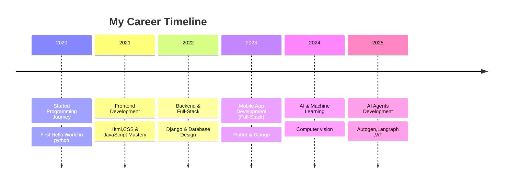

<!-- Stylish GitHub Profile Dashboard -->


<h1 align="center">Hi 👋 I'm Kishore Kumar</h1>

<h3 align="center">

[](https://git.io/typing-svg)
</h3>

<div align="center">
  <a href="https://www.linkedin.com/in/kishore-kumar-31b34224a/" target="_blank">
    
  </a>
  <a href="mailto:kishorekumararcot@gmail.com" target="_blank">
    
  </a>
</div>


<!-- Glowing Divider -->


<p align="center">
  
</p>

### 👨‍💻 About Me

- 🚀 GenAI Intern @ **RandomTrees**
- 🌱 Exploring **Vision Language Models, Agent Frameworks (Autogen, LangGraph), MCP (Model Context Protocol)**
- 💡 Fun Fact: *Interested in building Intelligent Systems* ✨
- 📫 Reach me at **kishorekumararcot@gmail.com**
- 📄 [Download My Resume](Kishore-Kumar-Resume.pdf)

---


```typescript
const developer = {
    name: "Kishore kumar",
    title: "Full-Stack Developer & AI Engineer",
    location: "🌍 Earth, Solar System",
    languages: ["JavaScript", "TypeScript", "Python", "Go", "Rust"],
    currentFocus: "Building scalable AI-powered applications",
    funFact: "I debug with console.log() and I'm not ashamed! 🐛",
    coffee: "☕ Powered by caffeine and curiosity",
    motto: "Code is poetry written in logic"
};
console.log(developer.motto);
```


  
<h2>Tools & Languages I code With!</h2>

  [](https://github.com/Varun-Mayilvaganan)

  <!--  -->
  ---
  


  <h2>Frameworks & Databases</h2>

  
 [](https://github.com/Varun-Mayilvaganan)
 


<!--  -->
---
  

<h2>Platforms & Tools</h2>

  [](https://github.com/Varun-Mayilvaganan)


<!-- Career Section with Glassmorphism Style -->
## 💼 Professional Journey

<div align="center">



</div>

<p align="center">
  
</p>

<p align="center">✨ "Always curious, always building AI systems smarter than yesterday." ✨</p>


