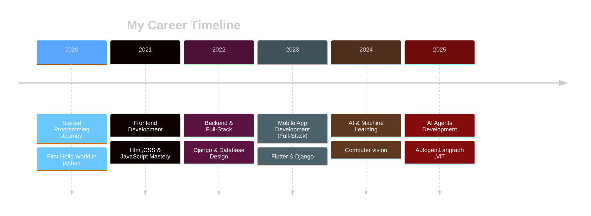

<!-- Dark Theme GitHub Profile Dashboard -->

<div align="center" style="background: linear-gradient(135deg, #0d1117 0%, #161b22 100%); padding: 20px; border-radius: 15px;">


<h1 align="center" style="color: #f0f6fc;">Hi 👋 I'm Kishore Kumar</h1>

<h3 align="center">

[](https://git.io/typing-svg)
</h3>

</div>

<div align="center" style="background: #161b22; padding: 15px; border-radius: 10px; margin: 20px 0;">
  <a href="https://www.linkedin.com/in/kishore-kumar-31b34224a/" target="_blank">
    
  </a>
  <a href="mailto:kishorekumararcot@gmail.com" target="_blank">
    
  </a>
</div>


<!-- Dark Theme Divider -->
<div align="center">
  
</div>

<p align="center">
  
</p>

<div style="background: #0d1117; padding: 20px; border-radius: 10px; border: 1px solid #30363d;">

### <span style="color: #58A6FF;">👨‍💻 About Me</span>

- 🚀 **GenAI Intern** @ <span style="color: #7C3AED;">**RandomTrees**</span>
- 🌱 Exploring <span style="color: #58A6FF;">**Vision Language Models, Agent Frameworks (Autogen, LangGraph), MCP (Model Context Protocol)**</span>
- 💡 **Fun Fact:** <span style="color: #A5F3FC;">*Interested in building Intelligent Systems*</span> ✨
- 📫 Reach me at <span style="color: #F85149;">**kishorekumararcot@gmail.com**</span>
- 📄 <span style="color: #58A6FF;">[Download My Resume](Kishore-Kumar-Resume.pdf)</span>

</div>

---


<div style="background: #161b22; padding: 20px; border-radius: 10px; border: 1px solid #30363d;">

```typescript
const developer = {
    name: "Kishore kumar",
    title: "Full-Stack Developer & AI Engineer",
    location: "🌍 Earth, Solar System",
    languages: ["JavaScript", "TypeScript", "Python", "Go", "Rust"],
    currentFocus: "Building scalable AI-powered applications",
    funFact: "I debug with console.log() and I'm not ashamed! 🐛",
    coffee: "☕ Powered by caffeine and curiosity",
    motto: "Code is poetry written in logic"
};
console.log(developer.motto);
```

</div>


  
<div style="background: linear-gradient(135deg, #0d1117 0%, #161b22 100%); padding: 20px; border-radius: 10px; margin: 20px 0;">

## <span style="color: #58A6FF;">🛠️ Tools & Languages I code With!</span>

[](https://github.com/Varun-Mayilvaganan)

</div>

<div align="center">
  
</div>
  


<div style="background: linear-gradient(135deg, #161b22 0%, #0d1117 100%); padding: 20px; border-radius: 10px; margin: 20px 0;">

## <span style="color: #58A6FF;">🚀 Frameworks & Databases</span>

[](https://github.com/Varun-Mayilvaganan)

</div>

<div align="center">
  
</div>
  

<div style="background: linear-gradient(135deg, #0d1117 0%, #161b22 100%); padding: 20px; border-radius: 10px; margin: 20px 0;">

## <span style="color: #58A6FF;">⚡ Platforms & Tools</span>

[](https://github.com/Varun-Mayilvaganan)

</div>


<!-- Career Section with Dark Theme -->
<div style="background: linear-gradient(135deg, #161b22 0%, #0d1117 100%); padding: 25px; border-radius: 15px; border: 1px solid #30363d; margin: 20px 0;">

## <span style="color: #58A6FF;">💼 Professional Journey</span>

<div align="center">



</div>

</div>

<div align="center" style="background: #0d1117; padding: 20px; border-radius: 10px; margin: 20px 0;">
  
</div>

<div align="center" style="background: linear-gradient(135deg, #161b22 0%, #0d1117 100%); padding: 20px; border-radius: 10px; border: 1px solid #30363d;">
  <p style="color: #A5F3FC; font-size: 18px; font-weight: bold;">✨ "Always curious, always building AI systems smarter than yesterday." ✨</p>
</div>


